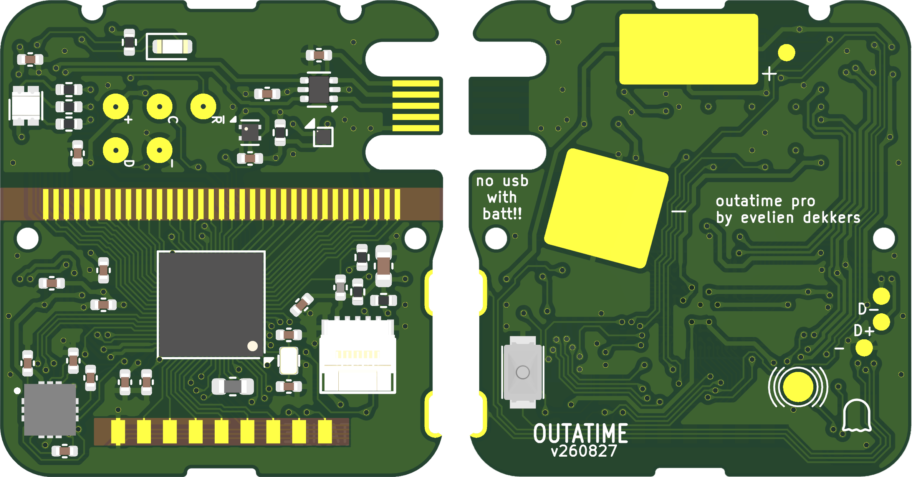

# Outatime Pro
A PCB for Casio CA-53W or 3208 module based on the [Sensor Watch Pro](https://github.com/joeycastillo/Sensor-Watch). It has the same features!

# Firmware
Firmware is being worked on [here](https://github.com/evyd13/second-movement).

# WARNING
THIS IS NOT TESTED IN ANY WAY. DO NOT ORDER THIS THINKING IT WILL WORK. FIRMWARE DOESN'T EXIST FOR IT YET. IT IS A WORK IN PROGRESS.
However, the PCB design is done.

## Version number
Version number is date formate yyMMDD, August 25th 2026 would be v260825.

# To-Do
The following still needs work:

- Firmware needs to be written (not my strongest skill, use pins from schematic)
- Need to figure out if the ATSAML22N comes with bootloader pre-installed, and how to flash it (J-Link?)
- LCD needs to be mapped (I intend to do this asap)
- PCB needs to be ordered and tested (I intend to do this in a few months time, need to gather funds for a prototype)
- It needs to be worn and loved!!

# Thanks to and relevant projects
- Joey Castillo for Sensor Watch, which this project is mostly based on. https://github.com/joeycastillo/Sensor-Watch/tree/main
- Travis Goodspeed, for incredible documentation about the Casio CA-53W. https://github.com/travisgoodspeed/goodwatch
- Vasily Zhuravsky, for a nice USB edge connector library https://github.com/vasya-zh/PCB-Edge-USB-connector-KiCad-library
- Dmitry Teplitsky, for making me think I can do it https://github.com/icelord75/icesio
- Greg Davill, for pointing the way to a microcontroller to use. https://github.com/gregdavill/advent-calendar-of-circuits-2020/tree/main/arm-watch
